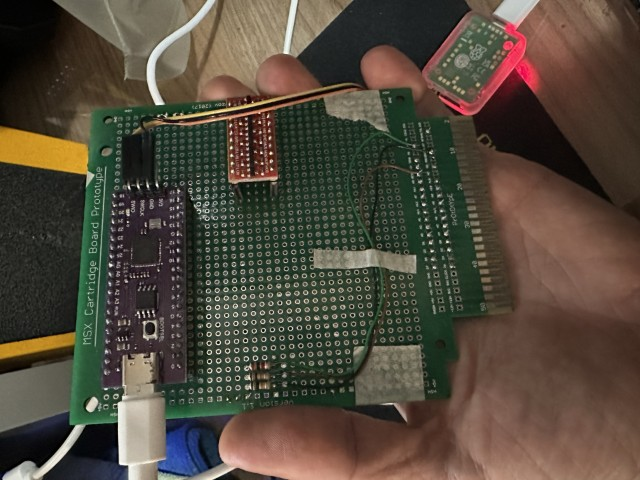
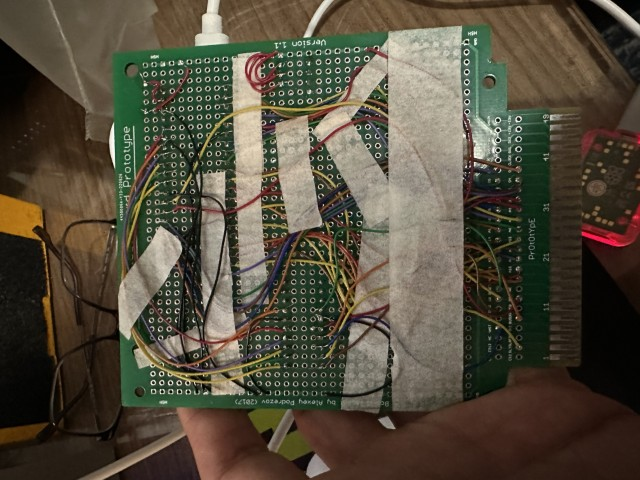
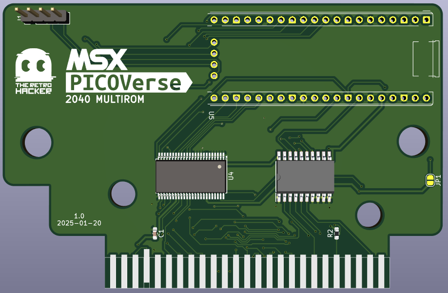
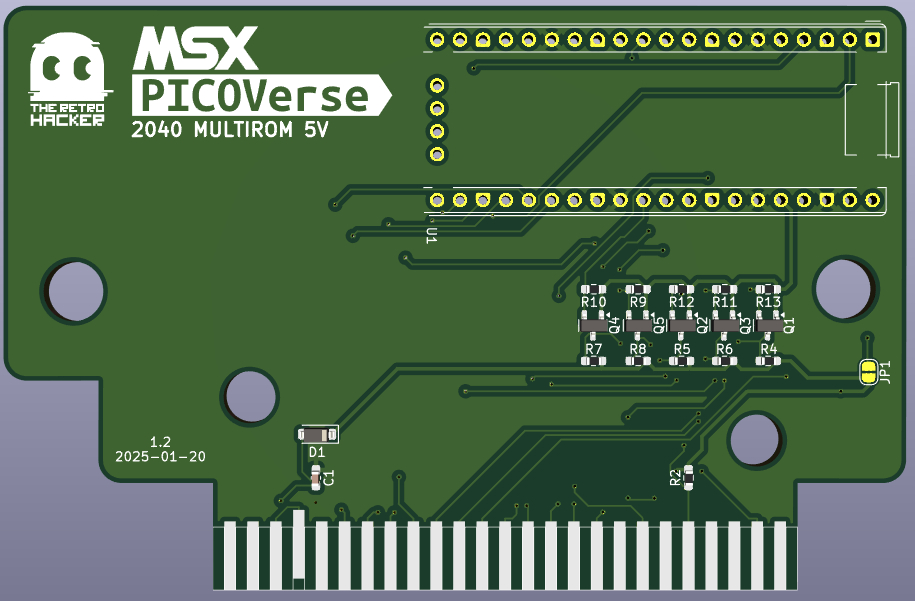
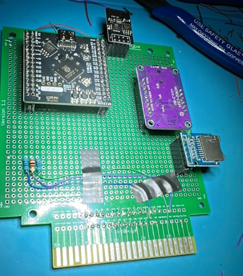
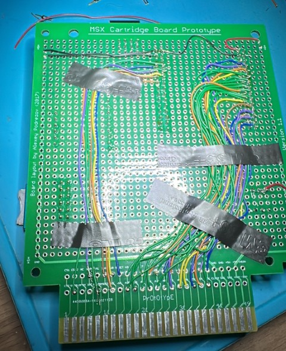

# MSX PicoVerse - The MSX experience driven by the RaspBerry Pico

The MSX PicoVerse is an open-source initiative aimed at developing multi-function cartridges for the MSX line of computers, utilizing variations of the Raspberry Pico development boards with the RP2040 and RP2350 integrated chips. 

This project aspires to enhance the MSX experience by enabling users to load ROMs, emulate hardware, connect to wireless networks, or even create new hardware through a software-defined approach.

The project is still in its early stages, and we are looking for contributors to help us develop the hardware and software. If you are interested in contributing, please reach out.

> **Note:** At this moment there is no guarantee that the boards and or software will work as expected. This project is still a work in progress. If you decide to build the hardware, you do so at your own risk.

## Hardware

Hardware was designed in two classes, first covering the RP2040 chip variants and the second covering the RP2350B chip variants. The designs are based on the Raspberry Pico development boards, which are widely available and have a large community of developers.

### Cartridges based on the RP2040 chip (PicoVerse 2040)

The RP2040 is a dual-core ARM Cortex-M0+ microcontroller operating initially at 133 MHz, featuring 264 KB of SRAM and support for external flash memory. It offers a variety of interfaces, including GPIO pins, SPI, I²C, UART, ADCs, PWM channels, and USB support.

| Prototype PCB (front) | Prototype PCB (back) |
|---------|---------|
|  |  | 

PicoVerse 2040 cartridges are designed for development boards that expose 30 GPIO pins and are **NOT compatible** with standard Raspberry Pi Pico boards. 

The goal was to use only the GPIO pins available on the boards and avoid the use of IO pin expanders or other components that could increase the complexity of the design. 

#### PicoVerse 2040 MultiRom Cartridge

The PicoVerse 2040 MultiRom allows the user to load multiple ROMs into the cartridge and select which one to boot. The cartridge  has a USB port that can be used to connect it to a computer and transfer the ROMs to the Pico flash memory.

A few boards were designed for the PicoVerse 2040 MultiRom Cartridge. Most of them have the GPIO pins connected to the MSX bus through level shifters. The level shifters are used to convert the 3.3V signals from the Pico board to 5V signals that are used by the MSX bus. One of the boards was designed to have the majority of the GPIO pins connected directly to the MSX bus without level shifters.

There is a debate about the safety of connecting GPIOs directly to 5V, as it can damage the Pico board as it is not officially documented that the GPIO pins can be connected directly to 5V. So use the board with the level shifters if you are concerned about that. 

Both cartridges have the same features, the only difference is the level shifters. They both use the Purple RP2040 board that is available on AliExpress.

|Cartridge Design Files|BOM|Image|
|-----------------------|------------------|------------------|
|[PicoVerse 2040 MultiRom](multirom/hardware/ALIEXPRESS-RP2040-PURPLE/1.0)|[BOM](https://htmlpreview.github.io/?https://github.com/cristianoag/msx-picoverse/2040/multirom/hardware/ALIEXPRESS-RP2040-PURPLE/1.0/bom/ibom.html)||
|[PicoVerse 2040 MultiRom 5V](multirom/hardware/ALIEXPRESS-RP2040-PURPLE-5V/1.2)|[BOM](https://htmlpreview.github.io/?https://github.com/cristianoag/msx-picoverse/2040/multirom/hardware/ALIEXPRESS-RP2040-PURPLE-5V/1.2/bom/ibom.html)||

#### PicoVerse 2040 Audio Cartridge

The PicoVerse 2040 Audio Cartridge is a cartridge that allows the user to play MP3 audio files on the MSX computer and implements audio related resources to be used by software running on the MSX computer. The cartridge has a USB port that can be used to connect the cartridge to a computer and transfer ROM or music files to the Pico flash memory. 

The cartridge features a MP3 player client for the MSX computer that can be used to play music files stored on the Pico flash memory.

|Cartridge Design Files|BOM|Image|
|-----------------------|------------------|------------------|
|TBI|||

#### PicoVerse 2040 WiFi Cartridge

The PicoVerse 2040 WiFi Cartridge is a cartridge that allows the user to connect the MSX computer to a wireless network. The cartridge has a USB port that can be used to connect the cartridge to a computer and update the firmware.

The cartridge features a UNAPI driver for the MSX computer that can be used to connect to a wireless network. The driver was created by Oduvaldo Pavan Jr. and is available on his [GitHub repository](https://github.com/ducasp/MSX-Development).

|Cartridge Design Files|BOM|Image|
|-----------------------|------------------|------------------|
|TBI|||

### Cartridges based on the RP2350B chip (PicoVerse 2350)

The RP2350, introduced in August 2024 by Raspberry Pi Ltd., is a high-performance microcontroller featuring a dual-core, dual-architecture design with selectable Arm Cortex-M33 or Hazard3 RISC-V cores, operating up to 150 MHz. It includes 520 KB of on-chip SRAM, supports up to 16 MB of external QSPI flash or PSRAM, and offers multiple communication interfaces (2× UART, 2× SPI, 2× I²C), 24 PWM channels, up to 8 ADC channels, 48 GPIO pins, USB 1.1 support, and 12 PIO state machines for flexible interfacing.

| Prototype PCB (front) | Prototype PCB (back) |
|---------|---------|
|  |  |

PicoVerse 2350 cartridges are based on development boards that expose 48 GPIO pins and are **NOT compatible** with conventional Raspberry Pi Pico 2 development boards, which typically expose only 26 GPIO pins. 

#### PicoVerse 2350 Multi Cartridge

This is a combined cartridge that includes the features of the MultiRom, Audio, and WiFi cartridges. The cartridge has a USB port that can be used to connect the cartridge to a computer and transfer ROM or music files to the Pico flash memory.

|Cartridge Design Files|BOM|Image|
|-----------------------|------------------|------------------|
|TBI|||

## Software

The software for the PicoVerse cartridges is being developed and it will be fully open-sourced. 

The RP2040 based carts are also compatible with the [MSX&#960;](https://github.com/piigaa-densetu-two-dai/MSXpi) project created by @piigaa-densetu-two-dai, so you can use any of the software alternatives created for that board with this open source hardware.

#### PicoVerse 2040 MultiRom Cartridge

As this was the first cartridge to be developed, there are a few software options available. You can check options with descriptions and download links in the [software](2040/multirom/software) folder.

The PicoVerse 2040 MultiRom Cartridge is also compatible with the [MSX&#960;](https://github.com/piigaa-densetu-two-dai/MSXpi) project created by @piigaa-densetu-two-dai, so you can use any of the software alternatives created for that board with this open source hardware.

#### PicoVerse 2040 Audio Cartridge

The software for the PicoVerse 2040 Audio Cartridge is being developed. The software will be fully open-sourced.

#### PicoVerse 2040 WiFi Cartridge

The software for the PicoVerse 2040 WiFi Cartridge is being developed. The software will be fully open-sourced.

#### PicoVerse 2350 Multi Cartridge

The software for the PicoVerse 2350 Multi Cartridge is being developed. The software will be fully open-sourced.

## License 

This work is licensed under a [Creative Commons Attribution-NonCommercial-ShareAlike 4.0 International License](http://creativecommons.org/licenses/by-nc-sa/4.0/).

* If you remix, transform, or build upon the material, you must distribute your contributions under the same license as the original.
* You may not use the material for commercial purposes.
* You must give appropriate credit, provide a link to the license, and indicate if changes were made. You may do so in any reasonable manner, but not in any way that suggests the licensor endorses you or your use.

**ATTENTION**

This project was made for the retro community and not for commercial purposes. So only retro hardware forums and individual people can build this project.

THE SALE OF ANY PART OF THIS PROJECT WITHOUT EXPRESS AUTHORIZATION IS PROHIBITED!

