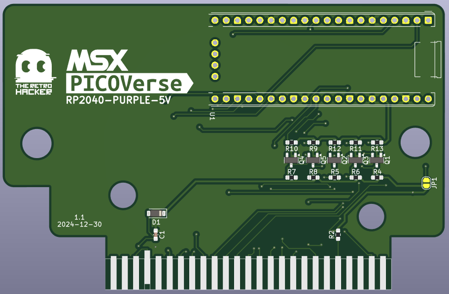
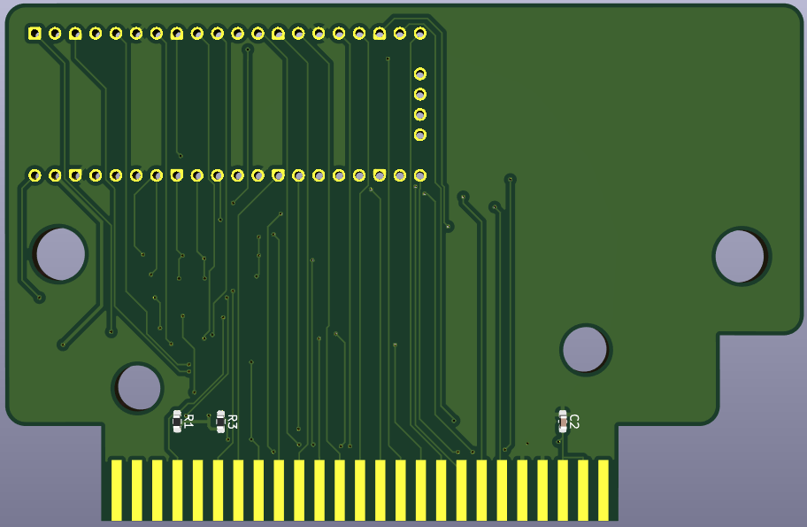

# MSX PicoVerse - The MSX experience driven by the RaspBerry Pico

The MSX PicoVerse is an open-source initiative aimed at developing multi-function cartridges for the MSX line of computers, utilizing variations of the Raspberry Pi Pico development boards or the RP2040/RP2350 integrated chips. 

This project aspires to enhance the MSX experience by enabling users to load ROMs, emulate hardware, or even create new hardware through a software-defined approach.

The project is still in its early stages, and we are looking for contributors to help us develop the hardware and software. If you are interested in contributing, please reach out.

> **Note:** There is no guarantee that the boards and or software will work as expected. This project is still a work in progress. If you decide to build the hardware, you do so at your own risk.

## Hardware

| Prototype PCB (front) | Prototype PCB (back) |
|---------|---------|
|  |  | 

The available versions for the cartridge are divided into two categories: 

### Cartridges based on the RP2040 chip (PicoVerse 2040)

| PCB Front Side | PCB Back Side |
|---------|---------|
|  |  |

The RP2040 is a dual-core ARM Cortex-M0+ microcontroller operating at up to 133 MHz, featuring 264 KB of SRAM and support for external flash memory. It offers a variety of interfaces, including GPIO pins, SPI, I²C, UART, ADCs, PWM channels, and USB support.

PicoVerse 2040 cartridges are designed for development boards that expose 30 GPIO pins and are **NOT compatible** with standard Raspberry Pi Pico boards. The table below shows the available designs and compatible boards:

|Cartridge Design Files|Compatible Pico 2040 Boards|
|-----------------------|------------------|
|[PicoVerse RP2040-PICO30](hardware/OLIMEX-RP2040-PICO30)|[OLIMEX RP2040-PICO30](https://www.olimex.com/Products/MicroPython/RP2040-PICO30/open-source-hardware)(1)|
|[PicoVerse RP2040-PICO30](hardware/OLIMEX-RP2040-PICO30)|[OLIMEX RP2040-PICO30-16](https://www.olimex.com/Products/MicroPython/RP2040-PICO30/open-source-hardware)(1)|
|[PicoVerse RP2040-PURPLE](hardware/ALIEXPRESS-RP2040-PURPLE)|[ALIEXPRESS RP2040 PURPLE](https://s.click.aliexpress.com/e/_DnbXqJF)|
|[PicoVerse RP2040-PURPLE 5V](hardware/ALIEXPRESS-RP2040-PURPLE-5V)(2)|[ALIEXPRESS RP2040 PURPLE](https://s.click.aliexpress.com/e/_DnbXqJF)|

(1) The OLIMEX boards are also open-source and can be built from the provided files available in the GitHub at https://github.com/OLIMEX/RP2040-PICO30

(2) The PicoVerse RP2040-PURPLE 5V is a modified version of the original design that connects the majority of the Pico GPIO pins directly to 5V. There is a debate about the safety of this approach, as it can damage the Pico board as it is not officially documented that the GPIO pins can be connected directly to 5V. This version only supports the AliExpress RP2040 PURPLE boards.

The board pictures shown above and the design that is being used for software development is the PicoVerse RP2040-PURPLE-5V.

### Cartridges based on the RP2350B chip (PicoVerse 2350)

The RP2350, introduced in August 2024 by Raspberry Pi Ltd., is a high-performance microcontroller featuring a dual-core, dual-architecture design with selectable Arm Cortex-M33 or Hazard3 RISC-V cores, operating up to 150 MHz. It includes 520 KB of on-chip SRAM, supports up to 16 MB of external QSPI flash or PSRAM, and offers multiple communication interfaces (2× UART, 2× SPI, 2× I²C), 24 PWM channels, up to 8 ADC channels, 48 GPIO pins, USB 1.1 support, and 12 PIO state machines for flexible interfacing.

PicoVerse 2350 cartridges are based on development boards that expose 48 GPIO pins and are **NOT compatible** with conventional Raspberry Pi Pico 2 development boards, which typically expose only 26 GPIO pins. Currently, the following boards are supported:

* [Pimoroni PGA2350](https://shop.pimoroni.com/products/pga2350?variant=42092629229651)
* [Olimex Pico2 XL](https://www.olimex.com/Products/RaspberryPi/PICO/PICO2-XXL/)
* [Olimex Pico2 XXL](https://www.olimex.com/Products/RaspberryPi/PICO/PICO2-XXL/)

## Software

### PicoVerse 2040

The software for the PicoVerse cartridges is being developed and it will be fully open-sourced. 

The RP2040 based carts are also compatible with the [MSX&#960;](https://github.com/piigaa-densetu-two-dai/MSXpi) project created by @piigaa-densetu-two-dai, so you can use any of the software alternatives created for that board with this open source hardware.

If you want to contribute to the software development, please check the [Software Playground](software/picoverse_2040/) folder for more information.

### PicoVerse 2350

The software for the PicoVerse 2350 cartridges is being developed. The software will be fully open-sourced.

## License 

This work is licensed under a [Creative Commons Attribution-NonCommercial-ShareAlike 4.0 International License](http://creativecommons.org/licenses/by-nc-sa/4.0/).

* If you remix, transform, or build upon the material, you must distribute your contributions under the same license as the original.
* You may not use the material for commercial purposes.
* You must give appropriate credit, provide a link to the license, and indicate if changes were made. You may do so in any reasonable manner, but not in any way that suggests the licensor endorses you or your use.

**ATTENTION**

This project was made for the retro community and not for commercial purposes. So only retro hardware forums and individual people can build this project.

THE SALE OF ANY PART OF THIS PROJECT WITHOUT EXPRESS AUTHORIZATION IS PROHIBITED!

